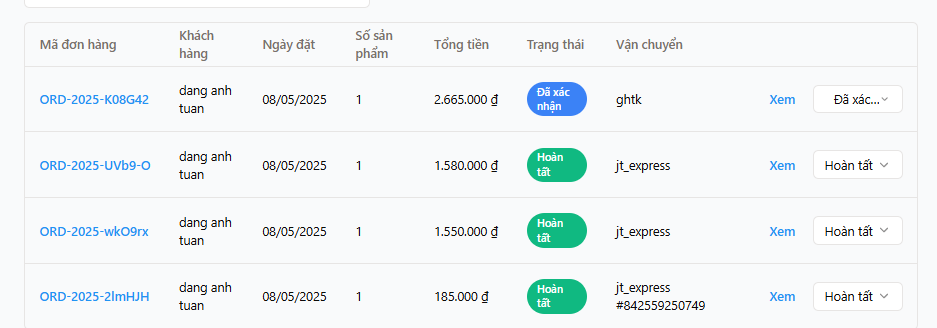

# Hệ Thống Quản Lý Đơn Hàng

Ứng dụng web được thiết kế để giúp doanh nghiệp vừa và nhỏ quản lý đơn hàng, khách hàng, sản phẩm và vận chuyển một cách hiệu quả.



## Tính Năng

- **Quản lý đơn hàng**: Tạo, sửa, xóa đơn hàng
- **Quản lý khách hàng**: Thông tin khách hàng, lịch sử mua hàng
- **Quản lý sản phẩm**: Thêm, sửa, xóa sản phẩm, quản lý tồn kho
- **Quản lý vận chuyển**: Tích hợp với nhiều đơn vị vận chuyển (GHN, GHTK, Viettel Post, J&T Express)
- **Báo cáo**: Doanh thu, sản phẩm bán chạy
- **Xuất báo cáo**: Xuất Excel, PDF

## Cài Đặt

### Yêu Cầu Hệ Thống

- Node.js v18+
- PostgreSQL

### Cài Đặt Cơ Sở Dữ Liệu

1. Cài đặt và cấu hình PostgreSQL
2. Tạo database và user:

```sql
CREATE DATABASE order_management;
CREATE USER order_user WITH ENCRYPTED PASSWORD 'your_password';
GRANT ALL PRIVILEGES ON DATABASE order_management TO order_user;
```

3. Tạo file `.env` dựa trên file `.env.example` và cấu hình thông tin kết nối database

### Cài Đặt Ứng Dụng

1. Clone repository
2. Cài đặt dependencies:

```bash
npm install
```

3. Khởi tạo cấu trúc database:

```bash
npm run db:push
```

4. Khởi tạo dữ liệu mẫu (tùy chọn):

```bash
./run-seed-db.sh
```

5. Khởi chạy ứng dụng:

```bash
npm run dev
```

Ứng dụng sẽ chạy tại địa chỉ [http://localhost:5000](http://localhost:5000)

## Cấu Trúc Dự Án

- `client/`: Mã nguồn frontend React/Vite
- `server/`: API và logic backend
- `shared/`: Schemas và types được dùng chung
- `scripts/`: Scripts tiện ích

## API Đơn Vị Vận Chuyển

Ứng dụng tích hợp với các đơn vị vận chuyển thông qua API:

- GHN (Giao Hàng Nhanh)
- GHTK (Giao Hàng Tiết Kiệm)
- Viettel Post
- J&T Express

Để kích hoạt tính năng này, cần bổ sung các API keys vào file `.env`:

```
GHN_API_KEY=your_ghn_api_key
GHTK_API_KEY=your_ghtk_api_key
VIETTEL_POST_API_KEY=your_viettel_api_key
JT_EXPRESS_API_KEY=your_jt_api_key
```

## Giấy Phép

Dự án được phát hành dưới giấy phép MIT.